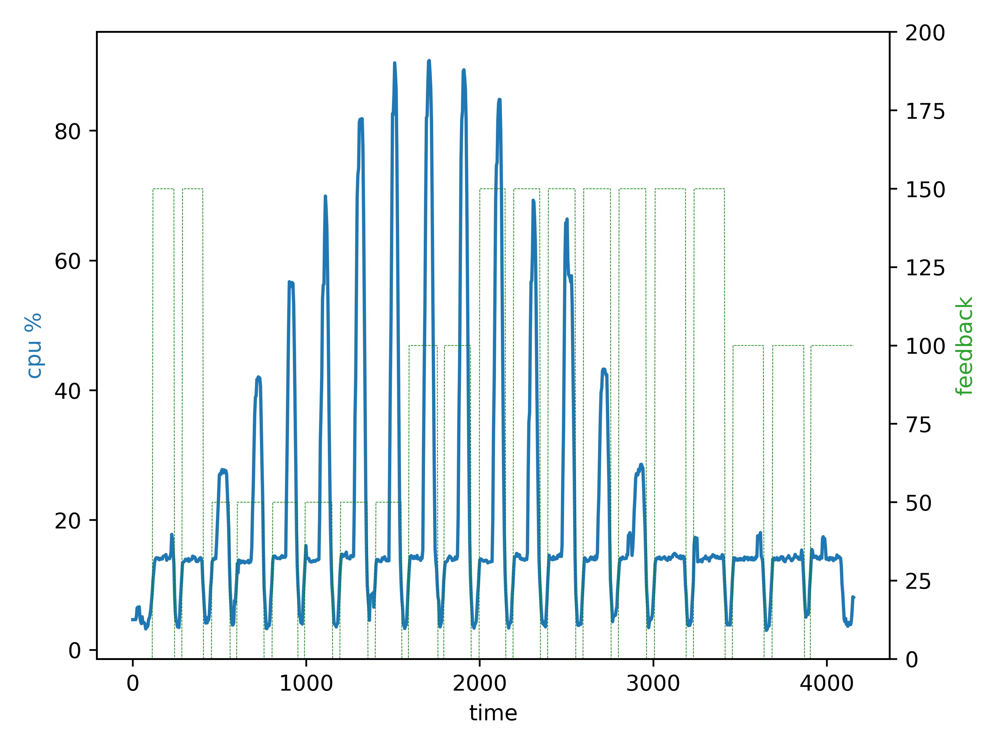
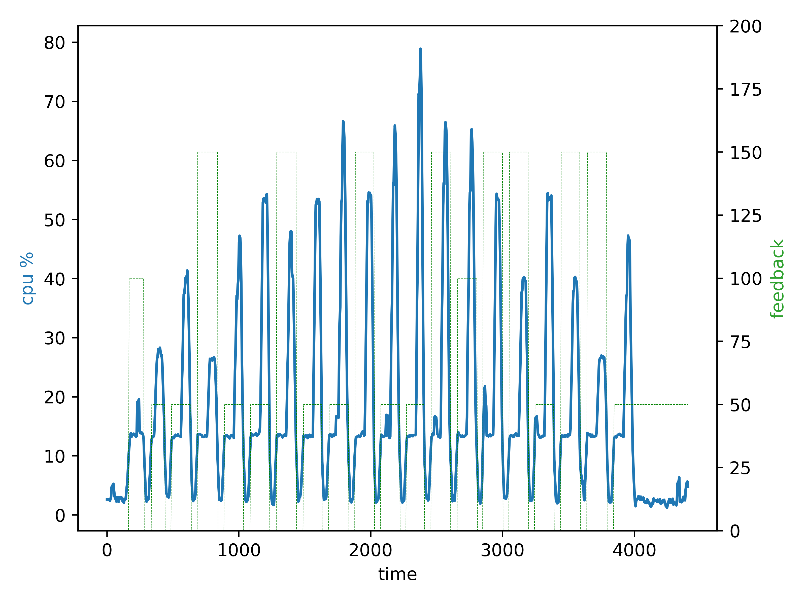

# Back Propagation

A Porting of Back Propagation to Konro

---
A Porting of Back Propagation to Konro
Back Propagation is a machine-learning algorithm that trains the weights of connecting nodes on a layered neural network. The application is comprised of two phases: the Forward Phase, in which the activations are propagated from the input to the output layer, and the Backward Phase, in which the error between the observed and requested values in the output layer is propagated backward to adjust the weights and bias values. In each layer, the processing of all the nodes can be done in parallel.

Our code implementation is an excerpt from backpropagation described in this link(Machine Learning, Tom Mitchell, McGraw Hill, 1997), and implements CUDA/OCL versions of bpnn_train kernel.

---

###### [https://www.cs.virginia.edu/rodinia/doku.php?id=back_propagation]


## Time Line

- Convert Back Propagation from c89 to c++20
- Insert DLB initialization in __facetrain.cpp::setup()__
- Insert Konro Add request in __facetrain.cpp::setup()__
- Insert the main computation kernel inside a loop and each time send new feedback following a fixed schedule in __facetrain.cpp::setup()__
  
## Feedback

Back Propagation sends feedback to Konro at the start of each new iteration.
Konro interpret these number as follow
- 0 - 70 <      Ask for new resources 
- 70 - 130  Nothing to be done
- 130 - 200 >     Ask for less resources 


## Requirements

- CMake 3.1 or later
- Clang++ 14 or later
- dlb 3.2 or later
- konro


## Compile

Create a build directory and inside it run the CMake con  figuration after had set all correct paths

``` bash
cmake -DCMAKE_CXX_COMPILER=path_to_compiler -DPATH_TO_KONROLIB=path_to_libkonrolib.a -DCMAKE_INSTALL_PREFIX="path_to_install_directory" -DCMAKE_BUILD_TYPE=Release ..
```

To build and install run
```bash
cmake --build . --target install
```

## Run

With Konro running in the background as daemon go to __./dist/bin__  and run
```bash
export OMP_NUM_THREADS=1
export DLB_ARGS="--drom --ompt"
./backprop 16500000
```

## Results


- **Schedule** `{150, 150, 50, 50, 50, 50, 50,
                                50,  100,  100,  150, 150, 150, 150,
                                150, 150, 150, 100, 100, 100};`
  


- **Schedule** `{100, 50, 50 , 150, 50, 50 , 150,50, 50 , 150, 50, 50 , 150, 100, 150, 150, 50, 150, 150, 50};`
  


